<div align="center">


# Pixel Modes Evolved

**The triggers and actions Android 17 Modes do not ship — put on each Mode's own page in Settings.**

Settings → Modes → *a Mode* → **Mode settings**, under "Set a schedule".

<br>

[](https://github.com/MrxSiN/PixelModesEvolved/releases)
[](https://github.com/MrxSiN/PixelModesEvolved/releases)
[](https://developer.android.com)
[](#status)

</div>

---

> [!WARNING]
> **Alpha.** This is an early release. It hooks Settings and system_server, and it has been
> tested on one device: a Pixel 8 Pro on **Android 17 QPR1, September 2026**
> (`CP3A.260905.009`). Expect rough edges, and keep a way to recover your phone.

## Why it works this way

Android 17 Modes can follow a time or a calendar, and nothing else. This module adds the
missing triggers and actions without a second settings app: every row is drawn on the Mode's
own page, with Settings' own preference classes, so it looks, animates and scrolls like the rest
of that page. The decisions run inside system_server, where a Mode can be switched without any
app holding a special permission.

|  | |
|---|---|
| 🧭 **Where you already are** | Triggers and actions sit on each Mode's page, next to its schedule. |
| 🔋 **Only what is needed runs** | A Wi-Fi-only setup never asks for location or motion. Each input starts when a rule needs it and stops when none does. |
| ✋ **You stay in charge** | A Mode is switched only when its triggers change between met and not met. Turn a Mode off by hand and it stays off until the triggers change again. |
| 🔁 **No reboot to update** | system_server hot reloads a new build; Settings restarts itself once it is out of sight. |
| 🧩 **Contained** | Every hook is protective. A failing trigger, action or page costs its own feature, never Settings or the system. |

---

## Features

<details open>
<summary><b>⚡ Triggers</b></summary>
<br>

Tap **Add a trigger** on a Mode's page and choose what turns the Mode on. It turns off again
when the triggers stop being met.

| Trigger | Met while | Watched with |
|---|---|---|
| **Wi-Fi network** | connected to a network with a given name | a `ConnectivityManager` network callback |
| **Bluetooth device** | a paired device is connected | connect and disconnect broadcasts |
| **Location** | inside a circle around a place | the fused provider, balanced power, about every 5 minutes |
| **Movement: on the move** | the phone is moving | the significant motion sensor, one-shot and low power |
| **Movement: left still** | the phone has not moved for 10 minutes | the same sensor |
| **Movement: flying** | on board an aircraft in flight | high-accuracy fixes every 3 minutes: speed and altitude |
| **Airplane mode** | airplane mode is on, or off | the `airplane_mode_on` setting |

Triggers are joined in order by **AND** or **OR**, with a connected button group between each
pair. As in ordinary logic, AND binds before OR: `Home Wi-Fi AND left still OR Car` means
`(Home Wi-Fi AND left still) OR Car`. A new trigger joins with AND.

<table>
<tr>
<td align="center">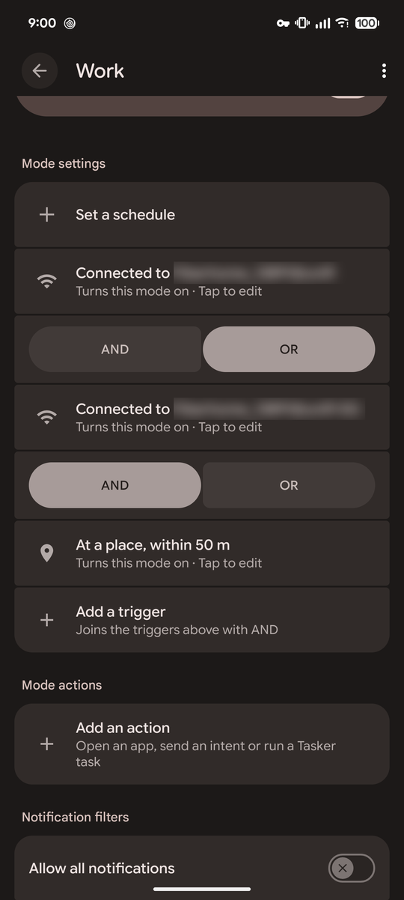<br><sub>Triggers and actions on a Mode's page</sub></td>
<td align="center">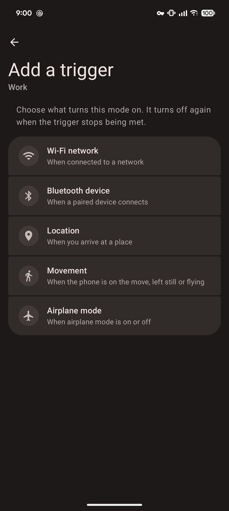<br><sub>Choosing a trigger</sub></td>
<td align="center">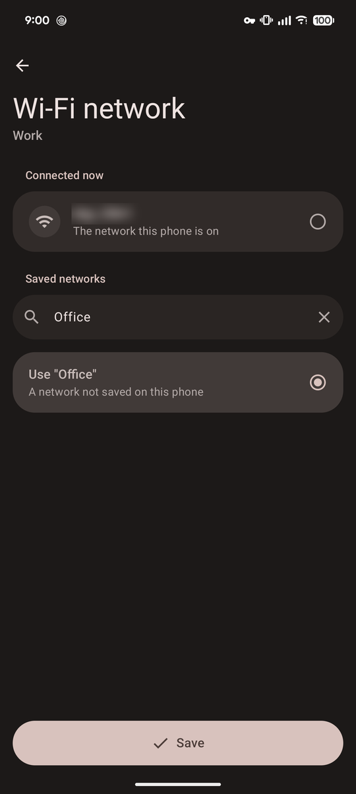<br><sub>Wi-Fi: the connected network, saved ones, or any name</sub></td>
</tr>
<tr>
<td align="center">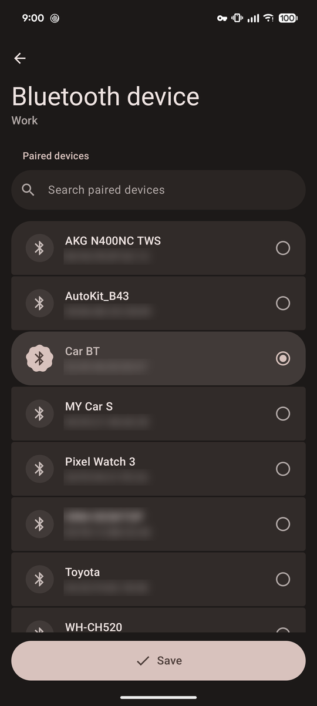<br><sub>Bluetooth: paired devices, searchable</sub></td>
<td align="center">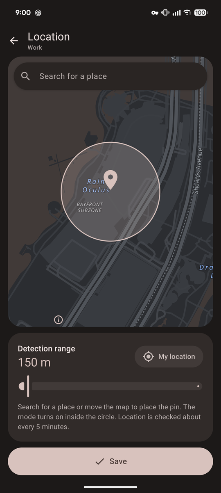<br><sub>Location: search a place, pan the pin, set the range</sub></td>
<td align="center">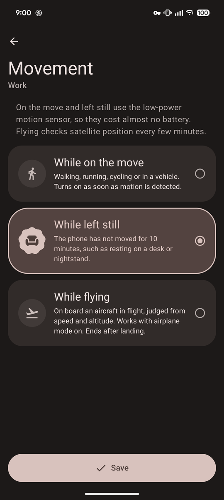<br><sub>Movement: on the move, left still or flying</sub></td>
</tr>
<tr>
<td align="center">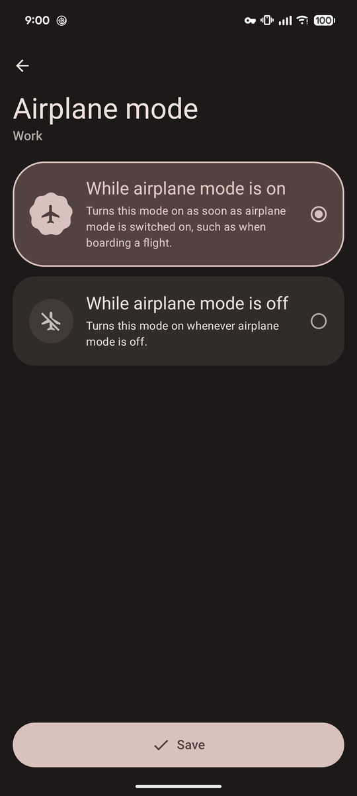<br><sub>Airplane mode: on or off</sub></td>
<td></td>
<td></td>
</tr>
</table>

The editor is built with Compose and Material 3 Expressive, in wallpaper colors, and all of its
motion follows `MaterialTheme.motionScheme`.

- **Wi-Fi** lists the network the phone is on and every saved network. The search field filters
  the list, or names a network the phone has never joined.
- **Bluetooth** lists paired devices, with a search bar.
- **Location** draws a vector OpenStreetMap (MapLibre with OpenFreeMap tiles, no API key), sharp on
  any screen. In dark mode it is repainted in the soft greys of Google Maps' dark theme; water takes
  the wallpaper color. Search for a place by name, pan the map under the pin, set the detection
  range, or jump to where you are.
- **Movement: flying** starts at 100 m/s, or at 50 m/s above 1,500 m, and ends on a fix below
  25 m/s. It works with airplane mode on.

</details>

<details open>
<summary><b>🎬 Mode actions</b></summary>
<br>

A **Mode actions** card under Mode settings runs something when the Mode turns on or off —
however it was switched: by a trigger, a schedule, Quick Settings or by hand. A button group
chooses **Turns on** or **Turns off** for each action.

| Action | What it does |
|---|---|
| **Open an app** | Opens an installed app on the screen. |
| **Send an intent** | Broadcasts an intent action, optionally to one package, with the extras `mode_id`, `mode_name` and `mode_active`. In Tasker, catch it with *Event › System › Intent Received*. |
| **Run a Tasker task** | Runs one of your Tasker tasks by name; the editor lists them. Tasker needs *Preferences › Misc › Allow External Access*. |

<table>
<tr>
<td align="center">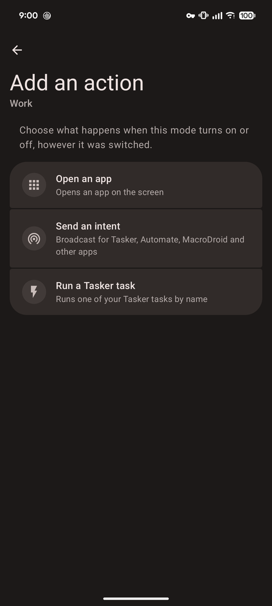<br><sub>Choosing an action</sub></td>
<td align="center">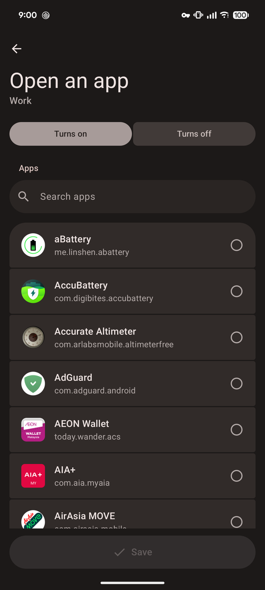<br><sub>Open an app</sub></td>
</tr>
<tr>
<td align="center">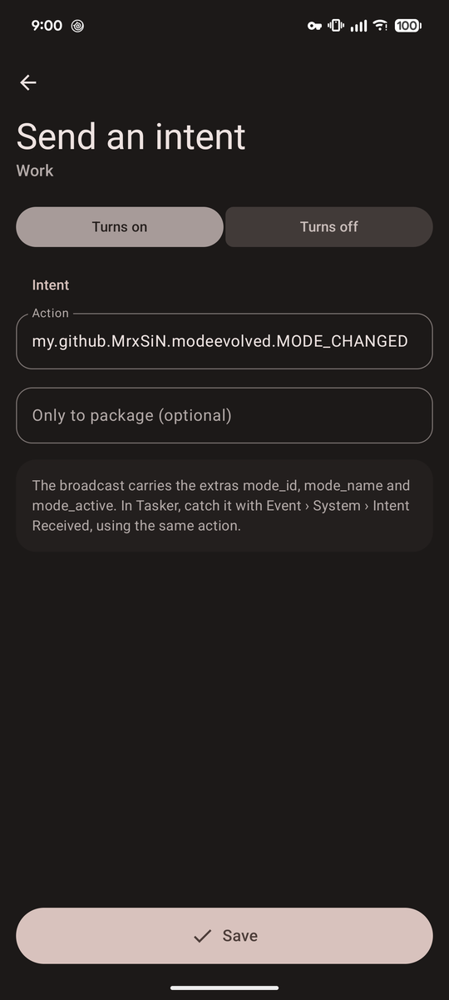<br><sub>Send an intent</sub></td>
<td align="center">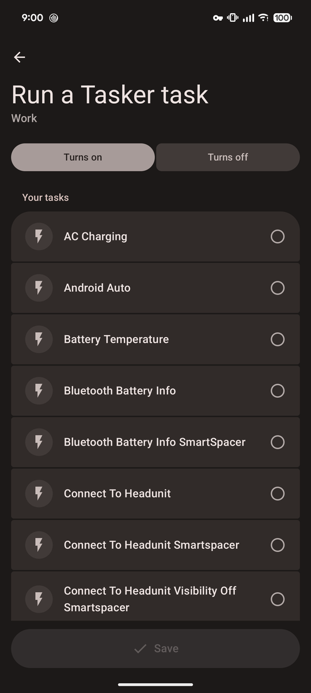<br><sub>Run a Tasker task</sub></td>
</tr>
</table>

Booting the phone or saving an action never replays an old change: the state a Mode is in when
its actions are loaded is only remembered.

</details>

<details open>
<summary><b>📅 Calendar event filter</b></summary>
<br>

Android's own **Calendar events** schedule turns a Mode on for every event in a calendar. The
module adds an **Event** row to that page, with three choices:

| Choice | Turns the Mode on for |
|---|---|
| **Any** | every event, as Android does by default |
| **One event** | one event picked from the next 30 days, and every repeat of it |
| **Keyword** | every event whose title contains a word or phrase, ignoring case — including events added later. The editor previews upcoming matches. |

The calendar and invite-reply controls stay Android's own. The filter travels inside the stock
schedule, and system_server applies it where Android checks each event.

<table>
<tr>
<td align="center">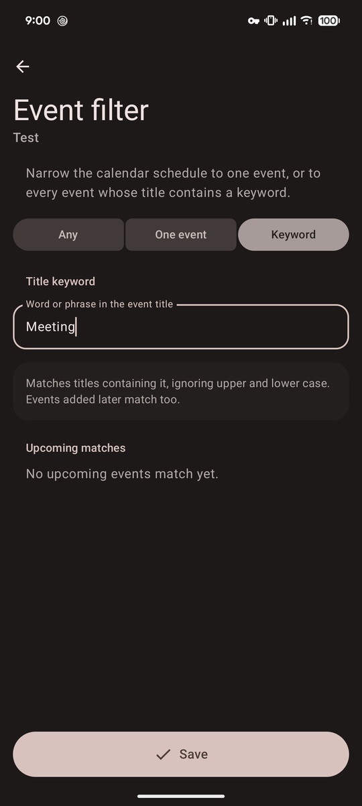<br><sub>Filtering by title keyword</sub></td>
</tr>
</table>

</details>

<details open>
<summary><b>🗑 Remove schedule</b></summary>
<br>

Android lets you give a Mode a schedule, but never take it away again. Both stock schedule
pages, **Day and time** and **Calendar events**, get a trash button at the top right. After a
confirmation the schedule page closes, the Mode goes back to having no schedule, and its page
offers "Set a schedule" again. The Mode's settings, triggers and actions stay.

<table>
<tr>
<td align="center">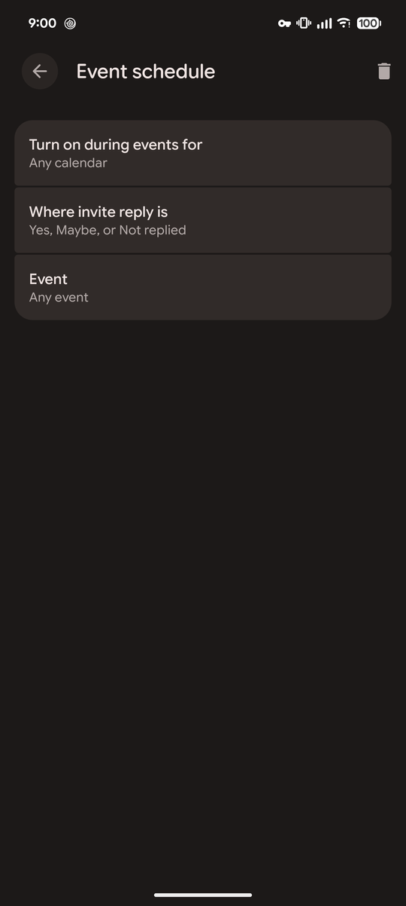<br><sub>The trash button on a schedule page</sub></td>
<td align="center">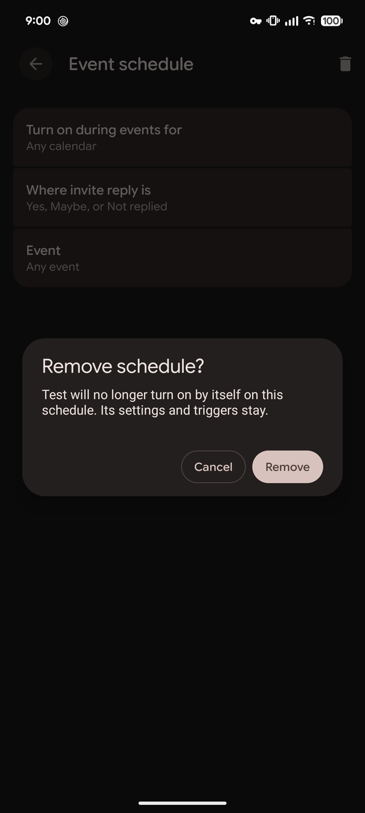<br><sub>Confirming</sub></td>
</tr>
</table>

</details>

---

## Status

**v0.0.1 — alpha.** Compatible with **Android 17 QPR1 (September 2026)**. Hooks reach into
Settings and system_server internals that can move between Android releases; when one moves, the
feature that needs it switches itself off and logs why, and the rest keep working.

Known limits:

- A scheduled Mode still follows its schedule, which can override a trigger at a schedule
  boundary. Triggers work best on Modes without a schedule.
- After an update is hot reloaded, triggers are judged afresh, as at boot: a met rule switches its
  Mode on, an unmet one leaves it alone.

## Requirements

| | |
|---|---|
| **Android** | 17 QPR1 (API 37), September 2026 |
| **Device** | Pixel (tested on Pixel 8 Pro) |
| **Framework** | [Vector](https://github.com/JingMatrix/Vector) v2.2+ (libxposed API 102 for hot reload; 101 works with a reboot per update) |
| **Root** | Required by the framework; the module itself asks for none |

Built against the modern [libxposed API](https://github.com/libxposed/api)
(`io.github.libxposed:api`), not the legacy `de.robv.android.xposed` bridge.

## Install

```
1. Install the APK from Releases
2. Enable Pixel Modes Evolved in Vector
3. Reboot once
4. Settings → Modes → a Mode → Mode settings
```

The module declares a **static scope** — System Framework and Settings — so there is nothing to
pick. It has no launcher icon; the trigger editor opens from the Mode page.

Later updates need no reboot: system_server hot reloads the new build, and Settings restarts
itself the next time it is out of sight.

---

## How it works

```
Settings (Mode page rows) ──Settings.Secure "mode_evolved_rules"──▶ system_server
                                                                    rules ─▶ TriggerEngine ─▶ NotificationManager
                                                                    SignalHub (Wi-Fi, Bluetooth, location, movement, airplane) ─┘
```

- **Settings** (scope `com.android.settings`). After `ZenModeFragment` refreshes, the module
  rebuilds its rows in the Mode page's trigger category, using Settings' own `androidx.preference`
  classes by reflection. A row starts the editor for a result. Settings reads saved networks, paired
  devices and the last position, because the editor app has no permission to, and passes them to
  the editor as JSON. Settings runs as the system uid, so it writes rules straight into
  `Settings.Secure`.
- **Editor** (this app). `EditorActivity` answers only Settings and returns one JSON result: save
  or remove, with the Mode id.
- **system_server** (scope `system`). Starts the automation when `NotificationManagerService`
  reaches `PHASE_BOOT_COMPLETED`, on its own thread. It observes the rules and switches Modes through
  the public `NotificationManager.setAutomaticZenRuleState`, which, called as the system uid, can
  drive Modes the system owns. Mode changes are noticed through `zen_mode_config_etag`, which
  Android rewrites after every change, and that is what runs Mode actions.

<details>
<summary><b>Deciding when a Mode switches</b></summary>
<br>

Decisions are edge-triggered: a Mode is switched only when its rule goes from met to not met or
back.

- At boot, a rule that is not met leaves its Mode alone, so a Mode started by hand or by schedule
  keeps running.
- Saving or editing a trigger applies the rule at once, met or not, and ends a manual override.
  Saving a trigger is an explicit choice.
- Removing the last trigger of a Mode that the triggers held on turns that Mode off.

Location requests are attributed as `android[PixelModesEvolved]`, visible in `adb shell dumpsys location`.

</details>

<details>
<summary><b>Updating without a reboot</b></summary>
<br>

- **system_server** is hot reloaded by Vector (`autoHotReload=true` in `module.prop`). Vector only
  reloads when the installed `versionCode` differs from the loaded one, so every build gets its own
  (seconds since 2026-01-01). The old build stops its automation and hands the system_server class
  loader and system context to the new one (`SystemServerPart`), which hooks again and restarts the
  automation at once.
- **Settings** declines hot reload, since its pages hold views and callbacks of the build that drew
  them. When the module is replaced, Settings stops itself as soon as none of its screens is visible
  (`ModuleUpdateRestarter`), so it opens on the new build next time. It never stops while on screen.
- For a moment after an update, old hook code in Settings reads the new APK's resources. Resource
  IDs are pinned in `app/resource-ids.txt` (aapt2 `--stable-ids`), so they never shift between
  builds. Commit that file.

</details>

---

## Build

```bash
./gradlew testDebugUnitTest lintDebug assembleRelease
```

Install the release build for daily use. The debug build is about 14 times larger and slow to
start, because Compose runs unoptimised in it. Release builds are shrunk with R8 and signed with
the local debug key; the module entry class is kept by name, because the framework resolves it from
`META-INF/xposed/java_init.list`.

`scripts/device.sh` installs and diagnoses over adb (root and Vector required):

```bash
scripts/device.sh install   # build, install, enable in Vector, set scope
scripts/device.sh check     # Vector state, scope, stored rules, recent log lines
scripts/device.sh logs      # follow the module's log
scripts/device.sh rules     # print the stored rules
scripts/device.sh modes     # each Mode's live state
```

Each switch logs `Mode <id> -> on|off`, and each input logs `Signal X: start|stop`.

## Design

```
ModeEvolvedModule   Xposed entry: routes system_server and Settings to their parts
store/              shared storage over Settings.Secure
trigger/            pure domain: trigger kinds, device state, rules — no Android code
rule/               rule codec and one TriggerKind per trigger
action/             Mode actions, their codec, and ActionAutomation
engine/             TriggerEngine decides, SignalHub runs inputs, ModeAutomation wires them
signal/             one SignalSource per Android input
system/             system_server: boot and hot reload, Mode switching, action running
calendar/           the calendar event filter and its codec
presentation/       label, icon and description per kind, shared by rows and editor
page/               Settings: Mode page rows, reflection boundaries, editor launch and results
editor/             the Compose editor app, one KindEditor per kind
```

To add a trigger, add one `Trigger`, one `TriggerKind`, one `TriggerPresentation`, one
`KindEditor` and, if it reads a new input, one `SignalSource`. To add an action, add one
`ModeAction`, one `ActionKind`, one `ActionPresentation`, one `KindEditor` and one `Performer` in
`IntentActionRunner`. Then register each in its list; nothing existing changes.
